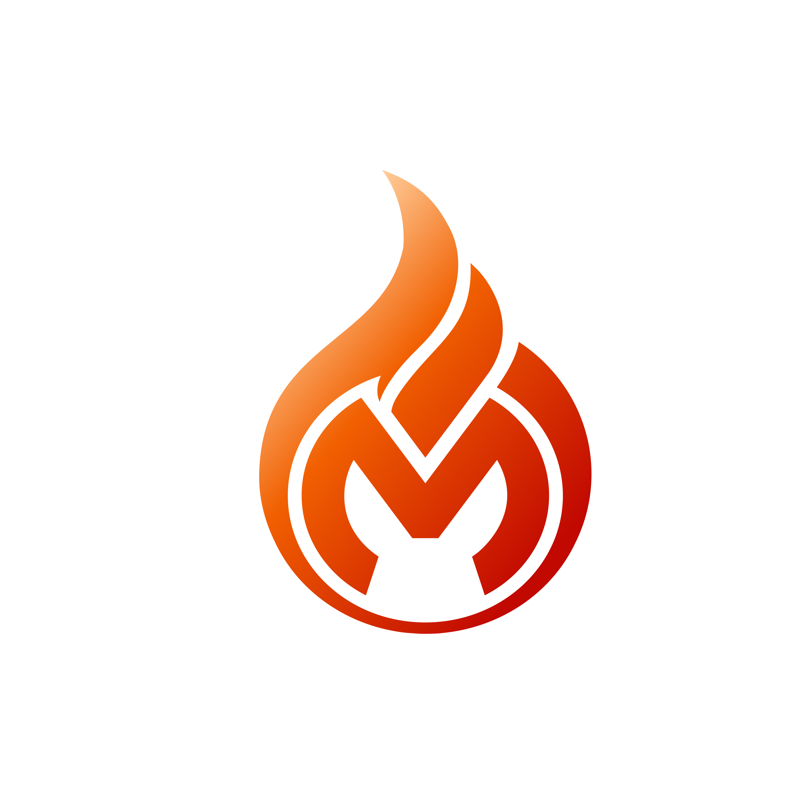
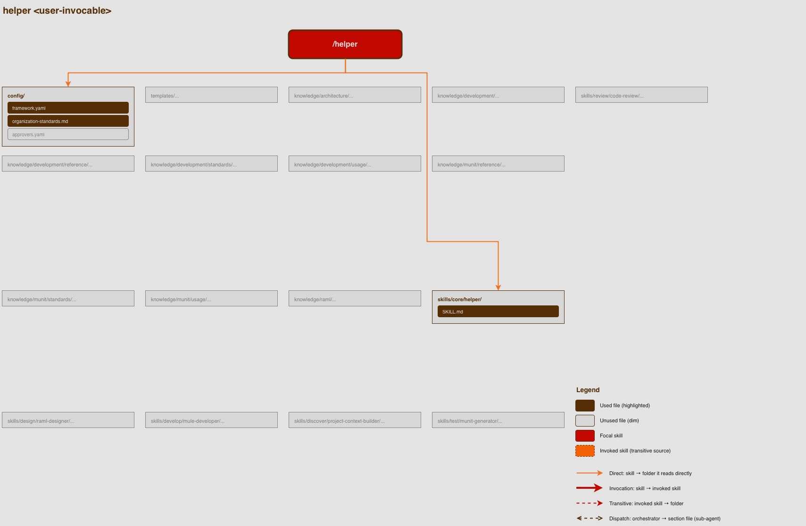
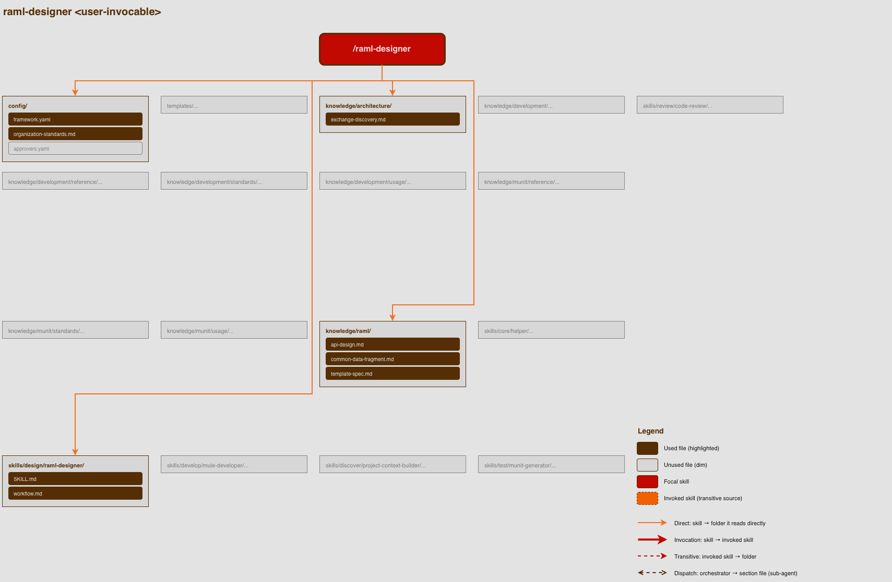
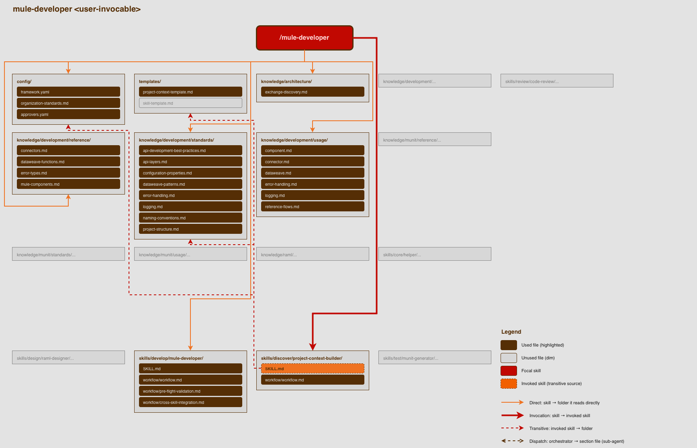
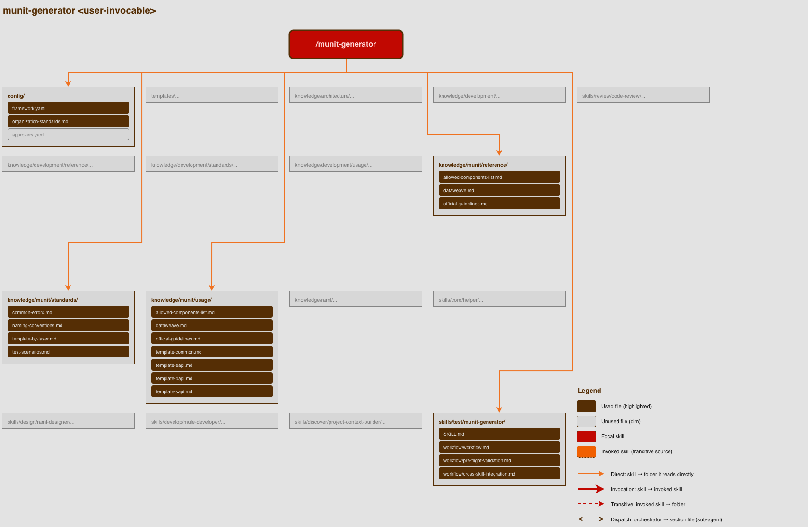
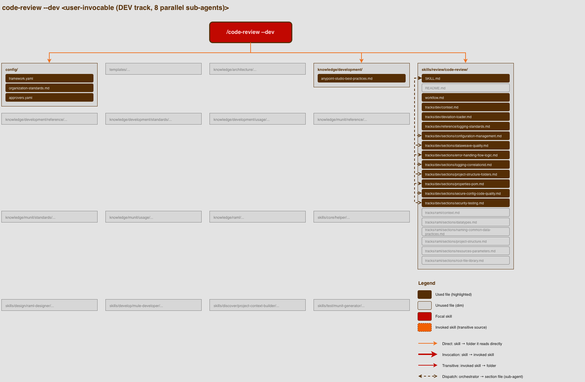
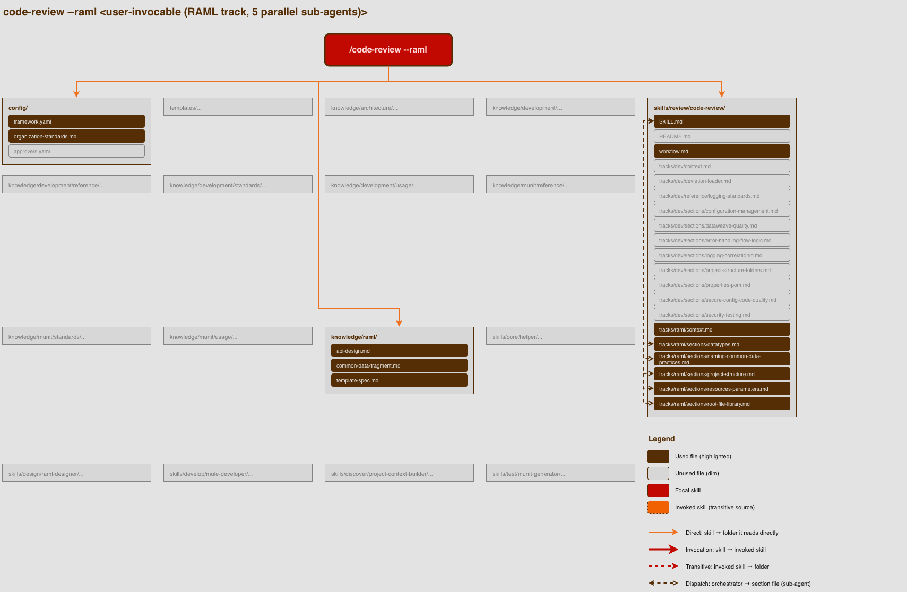

# FLAME — Full Lifecycle Applications MuleSoft Engine



> AI-powered toolkit for MuleSoft development. Installed once, operates on any project.

FLAME runs as a set of [Claude Code](https://www.claude.com/product/claude-code) skills that cover the full MuleSoft development lifecycle: discovering project context, designing RAML APIs, implementing Mule flows, generating MUnit tests, and reviewing code. Each skill specializes in one phase and consults a shared knowledge base of MuleSoft standards, references, and patterns — so the AI doesn't have to guess what your team's conventions are.

FLAME is open-source and built for the MuleSoft community. Contributions, feedback, and forks are welcome.

**License:** Apache 2.0 (see [LICENSE](LICENSE))

## Lifecycle phases

FLAME organizes the MuleSoft development workflow into four phases. Each skill belongs to one phase and runs at the appropriate point in the pipeline.

```
┌────────┐     ┌─────────┐     ┌───────┐     ┌────────┐
│ Design │ ──▶ │ Develop │ ──▶ │ Munit │ ──▶ │ Review │
└────────┘     └─────────┘     └───────┘     └────────┘
```

| Phase | Purpose | Skill(s) |
|---|---|---|
| **Design** | Design RAML 1.0 API specifications | `raml-designer` |
| **Develop** | Implement Mule flows and DataWeave transformations | `mule-developer` |
| **Munit** | Generate and fix MUnit tests | `munit-generator` |
| **Review** | Multi-sub-agent code review against organization standards | `code-review` |

The `helper` skill is **transversal** — it runs at any phase, providing general MuleSoft expertise and pointing users to the right specialized skill.

The `project-context-builder` skill runs **behind the scenes** — it's invoked automatically by `mule-developer` when a project's context file is missing or incomplete. Not user-invocable.

## Prerequisites

Before installing FLAME, make sure you have:

- **[Claude Code](https://www.claude.com/product/claude-code)** — the CLI or the VS Code/JetBrains extension. FLAME runs as a set of Claude Code skills.

  > 🚨 **Recommendation:** We STRONGLY recommend the usage of **Claude Enterprise** (Claude for Work). Consumer plans (Free, Pro, Max) may use your prompts and code for LLM training/improvement under their default terms; Enterprise plans typically guarantee that your data is not used for training. If you'll be using FLAME on proprietary MuleSoft code, verify the data-handling terms of your Claude plan before proceeding.

- **MuleSoft Anypoint Studio** — used to scaffold each new Mule project (File → New → Mule Project → "Generate from local file" or "Generate from Exchange"). FLAME does not scaffold projects directly; it picks up after Studio has produced the `pom.xml`, `mule-artifact.json`, and APIkit-routed flows. From that point onward, every skill operates on the Studio-generated folder.
- **Anypoint Platform account** — needed for any project deployed to CloudHub, Runtime Fabric, or on-prem, and for accessing Exchange assets.
- **Java** and **Maven** — required to build and run MuleSoft projects.
- **Node.js 18+** and **npm** — required to install and run the Anypoint MCP server (skip if you choose "no MCP" during setup).
- **Git** — to clone FLAME and to track changes in your own projects (code-review uses git to scope the review to modified files).

### Nice to have

- **Python 3** — Claude Code can use Python for some analysis and tooling tasks, which can speed up certain workflows.

## Installation

### 1. Clone FLAME

```bash
git clone https://github.com/Flame-Framework/flame-official-framework.git
```

You can clone anywhere — `~/Desktop/FLAME`, `~/projects/flame`, wherever you prefer.

### 2. Ask Claude to install it

Open Claude Code, navigate to the cloned FLAME folder, and tell Claude:

> "Read SETUP.md and install FLAME."

Claude will:
- Symlink every skill into `~/.claude/skills/` so the slash commands are available
- Optionally clone and configure FLAME's MCP server (if you want Anypoint Platform integration)
- Walk you through 8 setup questions to populate `config/framework.yaml` with your organization's specifics

After this, FLAME is fully installed and ready to use.

## First-time setup

The setup runs automatically as part of installation — when Claude reads `SETUP.md`, it triggers the question flow. You'll be asked about:

1. Your organization name
2. The prefix used in your MuleSoft project names (e.g., `acme-`)
3. The workspace folder where your Mule projects live
4. Whether your team uses a custom parent POM
5. Whether you want to install FLAME's MCP server to connect with Anypoint Platform
6. Whether your organization publishes shared RAML fragments (libraries, common-data) that projects should import from
7. Maximum attention points threshold for code reviews (default: 6)
8. RAML medium-rules-failed threshold percentage (default: 50%)

Skip optional questions with "no" or "skip" — only the first three (organization name, prefix, workspaces) are mandatory.

After all answers are collected, Claude writes them to `config/framework.yaml` and FLAME is ready to use.

> The complete question flow, with answer formats and how each answer maps to the YAML structure, is in **[SETUP.md](SETUP.md)**.

## Project lifecycle with FLAME

A typical MuleSoft project flows through FLAME like this:

1. **Design the API contract** — run `/raml-designer` (or bring your own RAML).
2. **Publish the RAML to Anypoint Exchange** — so the Mule project can pull it from a stable, versioned source.
3. **Scaffold the Mule project in Anypoint Studio** — File → New → Mule Project → "Generate from Exchange" (or "Generate from local file"). Studio produces the `pom.xml` (with `mule-apikit-module` and connectors), `mule-artifact.json`, and the APIkit-routed flow skeletons. FLAME does not perform this step.
4. **Develop the implementation** — `cd` into the Studio-generated folder and run `/mule-developer <project-name>`. On first run, `project-context-builder` is invoked automatically to capture the project's facts and conventions.
5. **Generate unit tests** — `/munit-generator <project-name>`.
6. **Review before merging** — `/code-review <project-name> --dev` (or `--raml` if reviewing the spec).

If you run `/mule-developer <project-name>` and the project doesn't exist in any configured workspace yet, the skill will pause and ask whether it's a new project (and point you at the Studio scaffold), an existing project at a different location, or a typo.

## Available skills

Each skill can be invoked independently at any time. The order below mirrors the typical MuleSoft development lifecycle, but you're free to pick whichever skill fits your current task.

### `/helper`

**User-invocable:** ✅ Yes — `/helper <question or task>`

Senior MuleSoft developer assistant and FLAME framework guide. Answers questions about MuleSoft (DataWeave, connectors, error handling, etc.), troubleshoots issues, and points you to the right specialized skill when your task fits one.

**Reads:** `config/framework.yaml`, `config/organization-standards.md`
**Writes:** nothing — output is conversational

---

### `/raml-designer`

**User-invocable:** ✅ Yes — `/raml-designer`

Designs RAML 1.0 API specifications following your organization's standards. Self-validates against the same rules that code-review enforces, so the specs ship clean.

**Reads:** RAML standards in `knowledge/raml/`, RAML code-review rule files
**Writes:** the RAML specification files

🎬 **Demo video — coming soon**

---

### `/mule-developer`

**User-invocable:** ✅ Yes — `/mule-developer <project-name>`

Implements Mule flows and DataWeave transformations against an existing Mule project. Lazy-loads knowledge files per workflow step to keep the context window manageable. Supports checkpoint/resume for long sessions.

**Reads:** `<PROJECT_ROOT>/project-context.md` (invokes `project-context-builder` to create it if missing), `knowledge/development/**`
**Writes:** Mule XML files and DataWeave files in your project

🎬 **Demo video — coming soon**

---

### `project-context-builder`

**User-invocable:** ❌ No — invoked automatically by `mule-developer` when needed

Discovers a Mule project's facts (integrations, domain entities, external constraints), recurring conventions (custom DW functions, error-handling patterns, naming styles), and approved deviations from FLAME standards. Writes everything to `<PROJECT_ROOT>/project-context.md`, which is then read by `mule-developer` and `code-review`.

**Reads:** Mule project files (`pom.xml`, Mule XMLs, properties, DWL), `templates/project-context-template.md`, knowledge standards
**Writes:** `<PROJECT_ROOT>/project-context.md`

---

### `/munit-generator`

**User-invocable:** ✅ Yes — `/munit-generator <project-name>`

Two modes:
- **Mode A** — generate new MUnit tests for endpoints that don't have them yet
- **Mode B** — fix failing MUnit tests (test-layer only — never modifies `src/main/`)

Follows a 3-phase pattern (Analysis → Planning → Implementation) with explicit user approval gates between phases. Lazy-loads MUnit knowledge files in batches per workflow step.

**Reads:** `knowledge/munit/**`, the Mule project under test
**Writes:** test files under `<PROJECT_ROOT>/src/test/munit/`

🎬 **Demo video — coming soon**

---

### `/code-review`

**User-invocable:** ✅ Yes — `/code-review <project-name> --dev|--raml`

Multi-sub-agent code review orchestrator. Two tracks:
- `--dev` dispatches **8 parallel sub-agents** (project structure, properties/POM, error handling, logging, DataWeave quality, secure config, security/testing, configuration management)
- `--raml` dispatches **5 parallel sub-agents** (project structure, root file/library, resources/parameters, datatypes, naming/common-data)

Reads `<PROJECT_ROOT>/project-context.md` for project-specific conventions and documented deviations. Findings are categorized: Blocking, Attention Point, Acknowledged Deviation, Claude Action.

**Reads:** the Mule project under review, `<PROJECT_ROOT>/project-context.md`, `config/approvers.yaml`, code-review rule files
**Writes:** nothing — output is the review report in the chat

🎬 **Demo video — coming soon**

## The `project-context.md` system

FLAME standards apply to all MuleSoft projects, but every project also has facts, conventions, and approved exceptions that are unique to it. Those project-specific things live in a file at the project root called `project-context.md`.

### What's in it

- **Facts** — integrations, domain entities, related APIs, external constraints. Used by `mule-developer` to ground implementation decisions in reality.
- **Project Conventions** — recurring patterns the project uses consistently (custom DW functions, error-handling shapes, etc.) that aren't in the FLAME standards. Advisory only — `mule-developer` reads them as context but `code-review` does not enforce them.
- **Documented Deviations** — places where the project intentionally violates a FLAME standard, with a named approver, ticket reference, expiry date, and justification. `code-review` honors valid deviations by re-categorizing matching findings to "Acknowledged Deviation" (still reported, doesn't count toward FAIL).
- **Open Issues** — anti-patterns the team knows about but hasn't decided what to do with yet. Read for the report, but never suppress findings.

### Who writes it and who reads it

| Skill | Reads | Writes |
|---|---|---|
| `project-context-builder` | ✅ (to regenerate) | ✅ (single canonical writer) |
| `mule-developer` | ✅ (facts + conventions only — not deviations/issues) | ❌ |
| `code-review` | ✅ (facts + conventions for context; deviations for finding re-categorization) | ❌ |

> **Only `project-context-builder` writes to this file.** No other skill modifies it.

### How deviations work

A deviation is rejected (treated as if not present) if any of the following are true:

- `approved-by` does not match an entry in `config/approvers.yaml`
- `approved-on` is in the future, or `expires` is in the past
- The cryptographic signature doesn't match (file was tampered with)
- The deviation targets a rule from the **non-waivable list** (security/secrets, TLS, correlationId, error-handling rule B-I.2 — these can never be deviated)

This means a manual edit to `project-context.md` cannot silently waive a real failure — code-review will catch it.

### How to add or regenerate a project's context

Run `/mule-developer` on a project that doesn't have a context file yet, or whose existing file is stale. It detects the missing/incomplete file and invokes `project-context-builder` automatically, walking you through discovery: facts, conventions, and deviations (with approver/ticket/expiry/justification for each).

## Configuration files

FLAME's behavior is tuned through three files in `config/`. The first-time setup populates them with your organization's specifics; you edit them later to change behavior.

### `config/framework.yaml`

Organization-wide settings — generated by the setup flow.

| Section | Purpose |
|---|---|
| `framework.name`, `framework.version` | FLAME identification |
| `organization.name`, `organization.project-prefix`, `organization.layers` | Your org name and project-naming conventions |
| `workspaces` | Folder paths where your Mule projects live (used for resolving project names to paths) |
| `parent-pom` (optional) | Custom Mule parent POM coordinates if your team uses one |
| `mcp.servers` (optional) | Registered MCP servers (e.g., FLAME's Anypoint MCP) |
| `raml.shared-fragments` (optional) | Shared RAML libraries your projects must/should import from |
| `review.dev.max-attention-points` | Threshold for `code-review --dev` (default `6`) |
| `review.dev.base-branch` | Base branch for git diff scope (e.g., `main`) |
| `review.raml.medium-threshold-percent` | RAML medium-rules failure threshold (default `50`%) |

Read by every skill on bootstrap.

### `config/organization-standards.md`

Free-form Markdown describing your organization's principles, tech stack, and guardrails — for example: "API-led connectivity is mandatory for new integrations", "all logs must use JSON Logger", "no production deploys on Fridays."

Skills read this on bootstrap to ground their recommendations in your team's actual rules. Unlike `framework.yaml`, there's no schema — write whatever your team needs to communicate.

### `config/approvers.yaml`

The list of people authorized to approve deviations from FLAME standards in any project's `project-context.md`.

```yaml
approvers:
  - name: "M. Silva"
    role: "tech-lead"
    notes: "Authorized 2025-01 onwards"
  - name: "J. Costa"
    role: "architect"
```

A deviation whose `approved-by` doesn't match an entry here is **rejected** by `code-review` — the underlying finding stays at its original severity.

If the list is empty (the default), every deviation is treated as having an unknown approver, which effectively disables the deviation-acknowledgement system. Populate this file before relying on `Documented Deviations` in projects.

## Repository structure

```
FLAME/
├── README.md                              # Overview, skills, configuration (this file)
├── SETUP.md                               # First-time setup instructions read by Claude
├── LICENSE                                # Apache 2.0 license
├── config/
│   ├── framework.yaml                     # Organization-wide settings
│   ├── organization-standards.md          # Your team's principles and guardrails
│   └── approvers.yaml                     # People authorized to approve deviations
├── skills/                                # FLAME skills, organized by lifecycle phase
│   ├── core/helper/
│   ├── design/raml-designer/
│   ├── develop/mule-developer/
│   ├── discover/project-context-builder/
│   ├── review/code-review/
│   └── test/munit-generator/
├── knowledge/                             # Domain knowledge bases (lazy-loaded by skills)
│   ├── architecture/
│   ├── development/                       # standards/, reference/, usage/
│   ├── munit/                             # standards/, reference/, usage/
│   └── raml/
├── templates/
│   ├── project-context-template.md        # Skeleton for per-project context files
│   └── skill-template.md                  # Boilerplate for authoring new skills
├── examples/                              # Reference artifacts (datatypes, diagrams, designs)
├── docs/
│   └── diagrams/                          # Architecture PNGs embedded in this README
└── mcp/
    └── README.md                          # FLAME MCP server documentation
```

## Knowledge base organization

The `knowledge/` folder is FLAME's repository of MuleSoft expertise. Skills lazy-load files from it as they progress through their workflows — only the relevant files are pulled into the context window per step, not the entire KB.

### Top-level domains

| Folder | What it covers |
|---|---|
| `knowledge/architecture/` | Architectural patterns (Exchange asset discovery, etc.) |
| `knowledge/development/` | MuleSoft implementation — flow design, DataWeave, error handling, logging, configuration, naming, connectors |
| `knowledge/munit/` | MUnit testing — templates per API layer, test scenarios, allowed components |
| `knowledge/raml/` | RAML 1.0 specification design and common-data conventions |

### Three-bucket pattern (`standards/`, `reference/`, `usage/`)

The `development/` and `munit/` domains follow a consistent three-bucket pattern:

| Bucket | Content type | Example |
|---|---|---|
| **`standards/`** | Rules — "must do" / "must not do" statements that code-review enforces | `naming-conventions.md`, `error-handling.md`, `logging.md` |
| **`reference/`** | Lookup tables — connectors, DataWeave functions, error types, allowed components | `connectors.md`, `dataweave-functions.md`, `error-types.md` |
| **`usage/`** | Code patterns and examples — how to implement common things | `connector.md`, `dataweave.md`, `reference-flows.md` |

The `architecture/` and `raml/` domains are flat (no sub-buckets) because their content is small enough.

### Customizing

To adapt the knowledge base to your organization, edit the relevant files directly. Skills always read the current content — no recompilation or restart needed.

Be careful when removing or renaming files that are listed in a skill's `knowledge-dependencies` frontmatter — that skill will fail to bootstrap. To audit which files each skill loads, see the architecture diagrams below.

## Architecture diagrams

The diagrams below show, per skill, which files in the FLAME repo are read or written when that skill runs. The legend (color-coded, on each diagram) explains the arrow types: direct read, invocation of another skill, transitive reach, and orchestrator-to-sub-agent dispatch.

### `/helper`



### `/raml-designer`



### `/mule-developer`



### `/munit-generator`



### `/code-review --dev`



### `/code-review --raml`



## Customizing FLAME

FLAME ships with sensible defaults but is built to be tuned to your organization. Common customizations:

### Add or remove deviation approvers

Edit `config/approvers.yaml`. Add each authorized person with their name, role, and (optional) notes. Names must match exactly the `approved-by` value used in any `project-context.md` deviation.

### Change review thresholds

In `config/framework.yaml`:

- `review.dev.max-attention-points` — how many Attention Points trigger a FAIL on `--dev` reviews (default 6)
- `review.raml.medium-threshold-percent` — percentage of Medium-severity RAML rules that must be violated for a FAIL (default 50%)
- `review.dev.base-branch` — branch code-review compares against for scoping (`main`, `develop`, etc.)

### Override knowledge base content

Every file under `knowledge/` is plain Markdown. Edit any file to add team-specific rules, examples, or references — skills pick up the changes on the next invocation, no restart needed.

To add brand-new content (e.g., a new connector reference, a new template), drop the file in the matching folder following the `standards/` / `reference/` / `usage/` bucket convention.

### Disable a code-review rule

There are two ways:

1. **Soft disable** (recommended): mark the violation as a Documented Deviation in `project-context.md` per project. The rule still fires, but matching findings are re-categorized to "Acknowledged Deviation" — listed but not counted toward FAIL.
2. **Hard disable**: edit the relevant section file under `skills/review/code-review/tracks/<dev|raml>/sections/` and remove or comment out the rule. This stops the rule from being validated globally.

### Add a new skill

Use `templates/skill-template.md` as a starting point. New skills must:
- Live under `skills/<phase>/<skill-name>/SKILL.md`
- Be symlinked into `~/.claude/skills/` (re-run the install)
- Follow the same frontmatter conventions as existing skills (see `templates/skill-template.md`)

## Updating

When FLAME upstream changes, you pull the latest:

```bash
cd <your-flame-clone>
git pull
```

If the update introduced new skills, ask Claude:

> "Re-read SETUP.md and link any new FLAME skills."

### Handling local customizations

FLAME's `git pull` can run into conflicts because your clone is also where you store **your organization's customizations**:

- `config/framework.yaml` — populated by setup with your org's specifics
- `config/organization-standards.md` — written by you / your team
- `config/approvers.yaml` — populated by you
- Anything under `knowledge/` you've edited to fit your team's rules

If upstream changes any of those files and you've changed them locally, git will produce a merge conflict.

**Recommended workflow:**

1. **Before pulling**, commit your local changes to a personal branch:
   ```bash
   git checkout -b my-org-customizations
   git add config/ knowledge/
   git commit -m "Local customizations for <your-org>"
   ```
2. **Pull upstream** changes onto `main`:
   ```bash
   git checkout main
   git pull
   ```
3. **Rebase or merge** your customizations on top of upstream:
   ```bash
   git checkout my-org-customizations
   git rebase main
   ```
   Resolve any conflicts the rebase surfaces — typically these are in `framework.yaml` (new fields added upstream) or knowledge files (rule wording changed upstream).

**If the conflict touches `framework.yaml`'s shape** (a new field was added upstream), Claude can help: ask it to *"compare my framework.yaml against the latest template in SETUP.md and tell me what's missing"*. It will list new fields and offer to walk you through populating them.

### Alternative: fork-based model

For larger teams or long-lived customizations, fork FLAME's repository to your organization's GitHub, work on a `org-customizations` branch in your fork, and periodically merge upstream `main` in. This gives your team full control over conflict resolution and lets multiple developers share the same customized FLAME.

## Troubleshooting

### Setup doesn't trigger when I ask Claude to install FLAME

Verify `config/framework.yaml` only contains comments (lines starting with `#`). Setup is detected by parsing the file and finding no active YAML keys. If there's any populated key from a previous run, Claude will skip setup — delete the file (or revert it to the commented template from upstream) and try again.

### A `code-review` finding is being reported even though it's listed as a Documented Deviation

The deviation is being rejected by the deviation-loader. Check, in order:
- **Approver not in list:** the `approved-by` name in `project-context.md` must match an entry in `config/approvers.yaml` exactly.
- **Expired:** `expires` date is in the past.
- **Stale evidence:** the code under the deviation has changed since the deviation was approved — the snippet hash no longer matches.
- **Non-waivable rule:** rules around security, secrets, TLS, correlationId, and B-I.2 (error-handling) cannot be deviated.

The review report shows the rejection reason for each deviation. Address the cited cause.

### `code-review --dev` fails with "Attention Points total > threshold"

You have too many Attention Point findings even though no Blocking findings. Either:
- Fix some of the Attention Point findings, or
- Raise the threshold in `config/framework.yaml` → `review.dev.max-attention-points`

### `mule-developer` says "project-context.md is required"

The project doesn't have a context file yet. Let `mule-developer` invoke `project-context-builder` to create one — answer the discovery questions when prompted.

### I edited a `knowledge/` file but `mule-developer` doesn't seem to use my changes

Skills read knowledge files on each invocation, so the next invocation should see the change. If the slash command was already running when you edited, finish that session and start a new one.

### `code-review` can't find my project

Make sure the project folder name matches the `<project-name>` argument exactly, and that the folder lives under one of the paths listed in `workspaces` in `config/framework.yaml`. If you moved the project or use a non-standard location, update `workspaces`.

### Slash commands not appearing in Claude Code

The symlinks under `~/.claude/skills/` are missing or pointing at the wrong location. Ask Claude:

> "Re-read SETUP.md and ensure all FLAME skills are symlinked correctly."

Claude will detect the broken or missing links and recreate them.

## License

FLAME is licensed under the **Apache License 2.0** — see [LICENSE](LICENSE) for the full text.

In short:
- You can use, modify, and distribute FLAME for any purpose, including commercially.
- Contributors automatically grant a patent license, so you're protected against patent claims from anyone who contributed code to the project.
- The license disclaims warranty and liability — FLAME is provided "as is."

**Trademark notice:** "FLAME" is a name associated with this project. Forking the code is welcome under the license; reusing the **name "FLAME"** for a different product is not. The Apache 2.0 license explicitly excludes trademark rights (§ 6).

## Contributing

Contributions from the MuleSoft community are very welcome — bug reports, feature requests, documentation improvements, new knowledge base content, additional skills, all of it.

### Before opening a PR

1. **Open an issue first** for anything beyond a small fix. This gives us a chance to align on direction before you invest the work.
2. **Read the relevant skill's `SKILL.md`** if you're changing a skill. The conventions (frontmatter format, workflow file layout, knowledge-dependencies) matter.
3. **Match the existing tone** in Markdown files — short sentences, concrete examples, no marketing language.

### PR conventions

- One logical change per PR. Don't bundle a rule update with a new skill.
- Use descriptive branch names: `fix/code-review-typo`, `feature/new-connector-rule`, `docs/clarify-setup`.
- Include before/after rationale in the PR description if you're changing rule severity or knowledge content.
- Run any relevant skill locally to confirm your changes don't break the workflow.

### Where to ask questions

- **Bugs / feature requests** → GitHub Issues on the FLAME repository
- **General MuleSoft discussion** → the MuleSoft community channels

We aim to review PRs within a week. If yours has been open longer without feedback, ping us on the issue thread.

FLAME was founded by Catarina Palma, Caue Follador, Filipe Melo, Guilherme Pinho, João Valente, Maria Costa, Pedro Meneres, and Renan Boff. The project is now maintained by the community.
